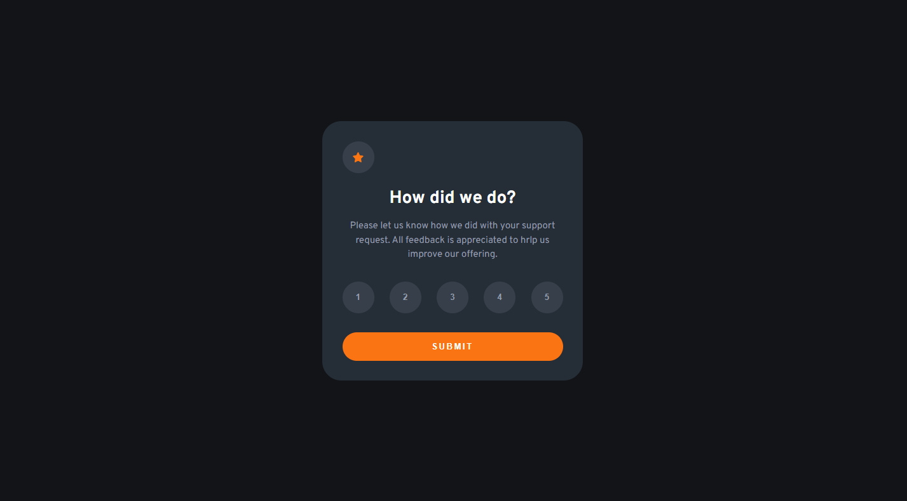
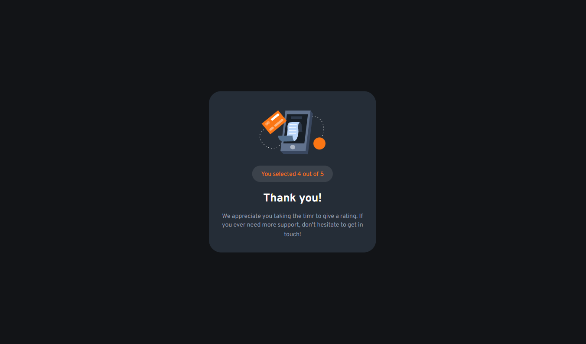
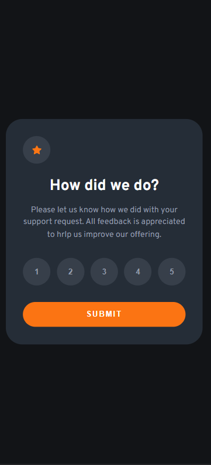
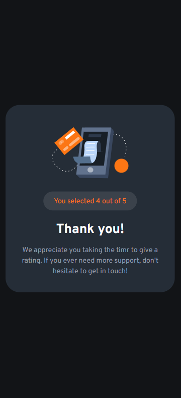

# Interactive Rating Component

This is a solution to the Interactive Rating Component challenge on Frontend Mentor. The challenge focuses on creating an interactive rating component where users can provide their ratings for a particular item.

## Table of Contents

-   [Overview](#overview)
    -   [Screenshot](#screenshot)
    -   [Links](#links)
-   [Features](#features)
-   [Technologies Used](#technologies-used)
-   [Getting Started](#getting-started)
    -   [Installation](#installation)
-   [Usage](#usage)
-   [State Management](#state-management)
-   [Styling](#styling)
-   [Code Quality](#code-quality)
-   [Author](#author)
-   [Acknowledgments](#acknowledgments)

## Overview

### Screenshot






### Links

-   Solution URL: [https://github.com/vishwa-akshat/interactive-rating-component](https://github.com/vishwa-akshat/interactive-rating-component)
-   Live Site URL: [https://interactive-rating-component-three-lemon.vercel.app/](https://interactive-rating-component-three-lemon.vercel.app/)

## Features

-   Interactive rating selection
-   Highlighting the selected rating
-   Rating submission

## Technologies Used

-   React
-   TypeScript
-   Vite
-   Sass
-   Zustand (State Management)

## Getting Started

### Installation

1. Clone the repository:

    ```bash
    git clone https://github.com/vishwa-akshat/interactive-rating-component.git
    ```

2. Navigate to the project directory:

    ```bash
    cd interactive-rating-component
    ```

3. Install the dependencies:

    ```bash
    npm install
    ```

## Usage

1. Start the development server:

    ```bash
    npm run dev
    ```

2. Open your browser and visit [http://localhost:5173/](http://localhost:5173/) to view the application.

## State Management

The project utilizes Zustand for state management. Zustand provides a simple and performant way to manage state in a React application. The state related to the selected rating and other UI interactions is managed using Zustand, ensuring a clean and predictable state management approach.

## Styling

The project uses Sass for styling, which allows for modular and maintainable stylesheets. The `_variables.scss` file contains global variables used for consistent theming and styling throughout the application.

## Code Quality

The project follows clean code principles to ensure readability, maintainability, and scalability. The codebase is structured in a modular manner, with reusable components and utility functions. Proper type annotations using TypeScript enhance code robustness and readability.

## Author

-   GitHub: [Akshat Vishwakarma](https://github.com/vishwa-akshat)
-   Frontend Mentor: [@vishwa-akshat](https://www.frontendmentor.io/profile/vishwa-akshat)
-   Twitter: [@akshatVis](https://twitter.com/akshatVis)

## Acknowledgments

Special thanks to Frontend Mentor for providing the challenge and inspiration for this project. The community support and resources have been invaluable in improving my coding skills.
